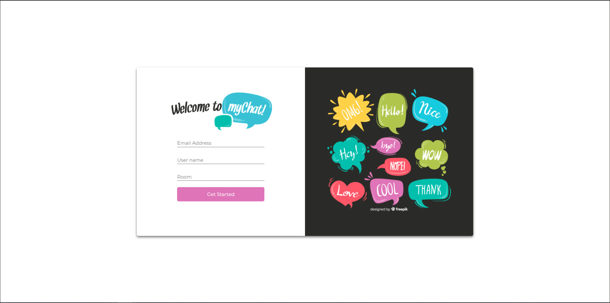
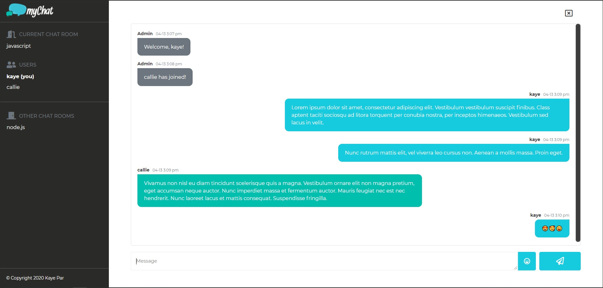
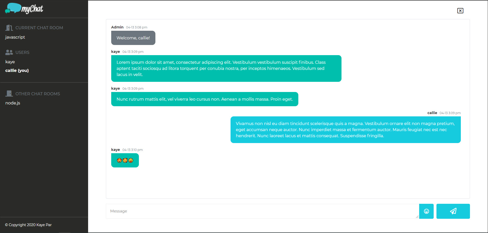
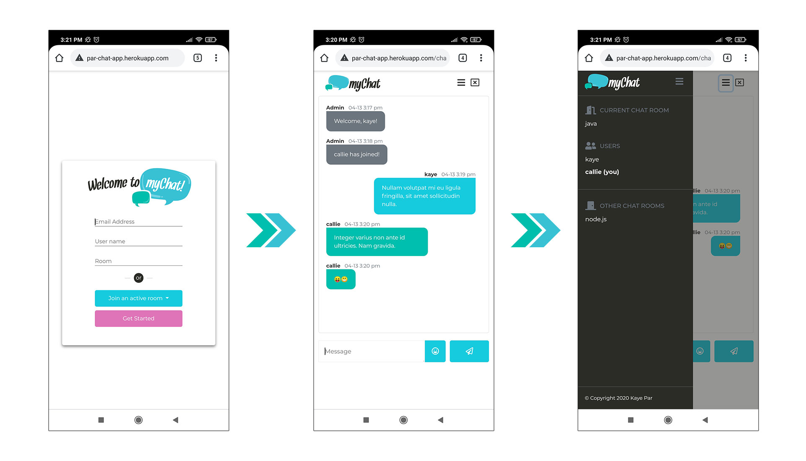

## Table of Contents

-   [Chat App](<#chat-App-(myChat)>)
-   [Getting Started](#getting-started)
    -   [Prerequisites](#prerequisites)
    -   [Installation](#installation)
-   [Running the tests](#running-the-tests)
-   [Limitation](#limitations)
-   [Built With](#built-with)
-   [Acknowledgements](#acknowledgements)
-   [Contact](#contact)

# Chat App (myChat)

A simple web-based chat application built with [Socket.io](http://socket.io), vanilla Javascript and [mongoDB](https://www.mongodb.com/).

**URL:** https://par-chat-app.herokuapp.com/

<div style="padding-bottom:10px">
    </img> 
</div>
<div style="padding-bottom:10px">
    </img> 
</div>
<div style="padding-bottom:10px">
    </img> 
</div>
<div>
  </img> 
</div>

Note: Best viewed on Chrome (on both mobile and desktop)

## Getting Started

These instructions will get you a copy of the project up and running on your local machine for development and testing purposes.

### Prerequisites

[Node.js](https://nodejs.org/en/) - get and install the latest version

### Installation

Follow below steps to setup the project on your local machine.

1.  Clone the project
    ```
    git clone https://github.com/kayepar/chat-app-mongodb
    ```
2.  Get project dependencies
    ```
    npm install
    ```
3.  Build files and start the server

    ```
    npm run parcel-dev
    ```

    You should see below console messages if successful

    ```
    [nodemon] 2.0.4
    [nodemon] to restart at any time, enter `rs`
    [nodemon] watching path(s): *.*
    [nodemon] watching extensions: js
    [nodemon] starting `node src/server.js hbs`
    Server running on port 80
    ...
    [nodemon] starting `node src/server.js hbs`
    [nodemon] restarting due to changes...
    √  Built in 29.89s.
    ...
    Server running on port 80
    ```

    Notes:

    -   If you encounter an error bundling handlebars (i.e. Cannot statically evaluate fs argument), you can ignore it. It's a known issue with parcel and handlebars.
    -   If hot module replacement becomes flakey with `npm run parcel-dev`, you can run parcel-watch and nodemon commands separately (each on its own terminal).
        -   `npm run parcel-watch` to automatically build files on change
        -   `npm run dev` to start server with nodemon

4.  Access `http://localhost` on your browser to view the app

    -   Should you wish to change the default port, open `src/server.js` and modify the port variable assignment.

        ```JS
        const port = process.env.PORT || 80;
        ```

    -   Logging is available in `console` and `/logs` folder for HTTP access and other important events

        ```
        2021-04-11T17:24:04.852Z info: GET /validateUser?email=kaye.cenizal@gmail.com&username=kaye&room=one 200 24.544 ms - 50

        2021-04-11T17:24:05.799Z info: GET /getActiveRooms 200 9.456 ms - 12

        2021-04-11T17:24:06.221Z info: kaye joined one
        2021-04-11T17:24:23.214Z info: kaye disconnected from one
        2021-04-11T17:24:23.827Z info: GET /getActiveRooms 304 6.775 ms - -
        ```

## Running the tests

-   Start automated tests (both unit and integration).

    Note: Make sure to stop any running server instance before proceeding. Integration tests will automatically start the server.

    ```
    npm run test
    ```

    **Example result:**

    ```
    PASS  tests/integration/app.socket.test.js (43.449 s)
    PASS  tests/integration/app.socket.db.test.js (34.963 s)
    PASS  tests/unit/src/controller/room-controller.test.js
    PASS  tests/integration/app.routes.test.js

    Test Suites: 4 passed, 4 total
    Tests:       73 passed, 73 total
    Snapshots:   0 total
    Time:        84.14 s
    Ran all test suites.
    ```

-   Start end-to-end tests (will open Chromium instances)

    ```
    npm run test:e2e
    ```

    **Example result:**

    ```
    PASS  tests/e2e/chat-app.test.js (199.324 s)
    End-to-end tests for chat app
    First user
      Index page
        On load
          √ Page should have 'myChat' as title (67 ms)
          √ Page should have focus on the email input box (119 ms)
        Input validation
          √ If missing all three fields, should show validation errors (501 ms)
          √ If email and username are missing, should show validation errors on both fields (1396 ms)
          √ If email and room are missing, should show validation errors on both fields (1226 ms)
          √ If username and room are missing, should show validation errors on both fields (1881 ms)
          √ If only email is missing, should show validation error (2242 ms)
          √ If only username is missing, should show validation error (1849 ms)
          √ If only room is missing, should show validation error (1205 ms)
          √ If email is invalid, should show validation error (2498 ms)
        Submit form
          √ If all fields are valid, should submit form when button is clicked (5457 ms)
      Chat page
        √ Message section, should display welcome message from admin (2311 ms)
        √ Sidebar, should show room name in 'Current Chat Room' section (255 ms)
    ...
    On mobile
      √ Should show a collapsed sidebar and a hamburger icon (1204 ms)
      √ If hamburger icon is clicked, should show sidebar (1244 ms)
      √ If sidebar is displayed, should show overlay on other half of screen (63 ms)
      √ If hamburger icon is clicked again, should close sidebar (1231 ms)
      √ If overlay is clicked, should close sidebar (1513 ms)
    Exit modal
      √ If exit button is clicked, should show modal (1325 ms)
      √ If 'No' is clicked, should close modal (467 ms)
      √ If 'Yes' is clicked, should return to login page (2970 ms)

    Test Suites: 1 passed, 1 total
    Tests: 72 passed, 72 total
    Snapshots: 0 total
    Time: 199.814 s
    Ran all test suites.

    ```

## Limitations

This version of the app does not come with a private chat functionality.

## Built With

-   [Node.js](https://nodejs.org/en/) - Server side runtime
-   [npm](https://www.npmjs.com/) - Package management
-   [Express.js](https://expressjs.com/) - Web application framework
-   [express-hbs](https://www.npmjs.com/package/express-hbs) / [Handlebars](https://handlebarsjs.com/) - Template engines
-   [Socket.io](https://socket.io/) - Realtime application framework
-   [mongoDB](https://www.mongodb.com/) - Database
-   [Mongoose](https://mongoosejs.com/) - ODM library
-   [Morgan](https://www.npmjs.com/package/morgan) - HTTP request logger
-   [winston](https://github.com/winstonjs/winston) - Logging library
-   [Parcel.js](https://parceljs.org/) - Web application bundler
-   [Jest](https://jestjs.io/) - Testing framework
-   [Puppeteer](https://pptr.dev/) - Browser automation library
-   [Bootstrap](https://getbootstrap.com/) - Front-end framework

## Acknowledgements

-   [Freepik](https://www.freepik.com/)
-   [Font Awesome](https://fontawesome.com/)
-   [Heroku](https://www.heroku.com/)
-   [MongoDB Atlas](https://www.mongodb.com/cloud/atlas)
-   [Emoji-button](https://github.com/joeattardi/emoji-button)
-   [jest-puppeteer](https://github.com/smooth-code/jest-puppeteer)
-   [Nodemon](https://nodemon.io/)
-   [Nodemailer](https://nodemailer.com/)

## Contact

Catherine Par - kaye.cenizal@gmail.com

LinkedIn - https://www.linkedin.com/in/catherine-par-bbba221a2/
